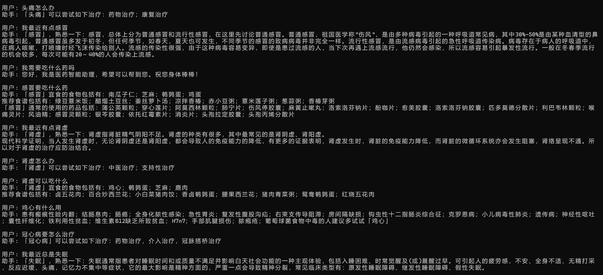

# 医疗问答助手 (Medical Q&A ChatBot)

基于知识图谱的智能医疗问答系统，使用 Neo4j 图数据库存储医疗知识，支持疾病症状、用药建议、饮食指导等多种问答类型。

---

## 📸 运行截图

### 对话示例1

---

## 🏗️ 项目结构
health_assistant/
│
├── build_medicalgraph.py # 构建医疗知识图谱
├── question_classifier.py # 问题分类器（实体识别 + 意图识别）
├── question_parser.py # 问题解析器（生成 Cypher 查询）
├── answer_search.py # 答案搜索器（查询数据库 + 格式化回答）
├── chatbot_graph.py # 主程序入口
│
├── data/
│ └── medical.json # 医疗数据文件（疾病信息）
│
├── dict/ # 词典目录
│ ├── disease.txt # 疾病词典
│ ├── symptom.txt # 症状词典
│ ├── drug.txt # 药品词典
│ ├── check.txt # 检查项目词典
│ ├── department.txt # 科室词典
│ ├── food.txt # 食物词典
│ ├── producer.txt # 药品生产商词典
│ └── deny.txt # 否定词词典
├── chat1.png # 运行截图1
└── README.md # 本文件

医疗数据来自https://github.com/liuhuanyong/QASystemOnMedicalKG

---

## 🚀 快速开始

### 环境要求

| 软件 | 版本要求 | 说明 |
|------|---------|------|
| Python | 3.7+ | 编程语言 |
| Neo4j | 4.x 或 5.x | 图数据库 |
| pip | 最新版 | Python 包管理工具 |

---

### 第一步：安装 Python 依赖
pip install py2neo pyahocorasick

### 第二步：修改配置文件
需要修改 2个文件 中的数据库密码

### 第三步：构建知识图谱
python build_medicalgraph.py

### 第四步：启动问答助手
python chatbot_graph.py

# 注意：安装并启动 Neo4j